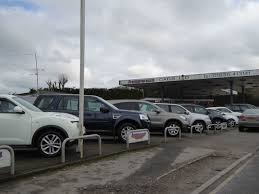
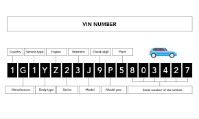
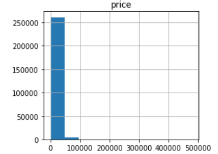
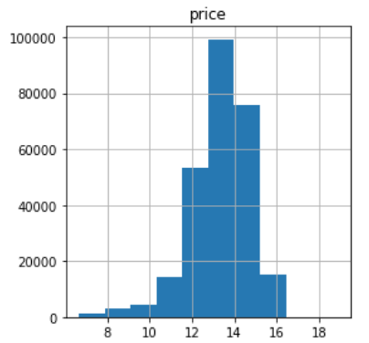
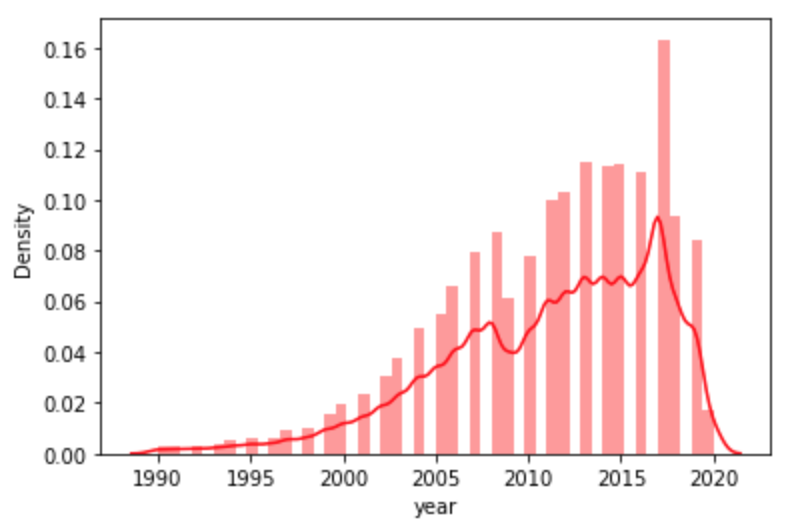
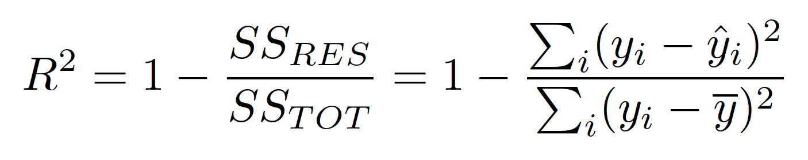

## Used Car Sale Price Prediction

A new car lot opening soon needs to buy inventory. They intend to know the price to sell each car before they acquire it so that they can account for their desired profit margin. So, the goal of this project is to create a regression model to predict the future sell price of a used car.

##### Data
The data needed to train the model is available on multiple used car websites. For ease of use, I used a dataset from Kaggle linked below. However, if I need more data in the future, then sites like autotrader and edmunds have ample used car data that is scrapable with the python library BeautifulSoup.

* https://www.kaggle.com/austinreese/craigslist-carstrucks-data)

##### Method
Among the options for supervised learning models that were tried (linear regression, SVM, MLP, XGB and decision tree) decision tree produced the best results at 57% (metric: R squared). RandomSearchCV with different parameters were used for hyper-parameters, which resulted in a 64% result. 

##### Data Cleaning
In order to manage the missing data, KNN Imputer from SKlearn was used to fill in data that was most similar to that item. This option seemed to preserve the data better than simply using the mean or median of the feature.

One of the features of this dataset was the VIN number, which at first glance seemed to be meaningless, however, after further inquiry, I learned that the VIN number holds information about the car’s year, model, make and a few other things. Armed with this knowledge, I was able to replace some missing values by decoding the VIN number saving thousands of rows of data. 

##### EDA

Looking through a histogram of each numerical column showed that much of the data was skewed including the dependent variable price. Below is a chart of price.

Non-Parametric Distribution vs Log Transformation
  

  

NOTE: the chart on the left is the original price chart before the log transform, which is on the right. A log transform was performed on all numerical skewed data.

Below is another example of the skewness of the year. We can see that it needs to be log transformed to make it more normal so that the model will perform better. 

Count per Year
  

This dataset is left skewed.

##### Algorithms and Machine Learning
I tried multiple different models regardless of the complexity of the model. For example, I tried a linear regression model, which is simple to understand. I also tried a multi layered perceptron, which is too complex to understand the steps that led to a prediction. In this case, I did not mind having a more complex model because understanding the reasoning for my predictions was not necessary. I mainly cared about the final predictions. If I had wanted to understand more about which cars gave better profit margins then I may have chosen a model that I could understand some of the logic behind which features were most influential so that I could make informed decisions about specific details of the cars to be bought. 

##### Metrics
I chose to use r squared as my metric so that I could see how well the features predicted the actual value or in different words, how well the predictions fit the curve. In other scenarios I may have opted for adjusted r squared to account for overfitting, however, for this first model, I was not picky on which columns to use. Adjusted R2 decreases with more  and more useless columns. 

  

##### Future Improvements
* Bin the prices to then predict a range of price rather than a specific price. This would turn into a classification model due to the discrete bins.
* Spend more time feature engineering
* Collect more data to train on

##### Credits
Thanks to my Springboard Student advisor for helping me to stay on track with my course, and to my SpringBoard mentor, Reza Saddodin for supporting and teaching me along the way.
